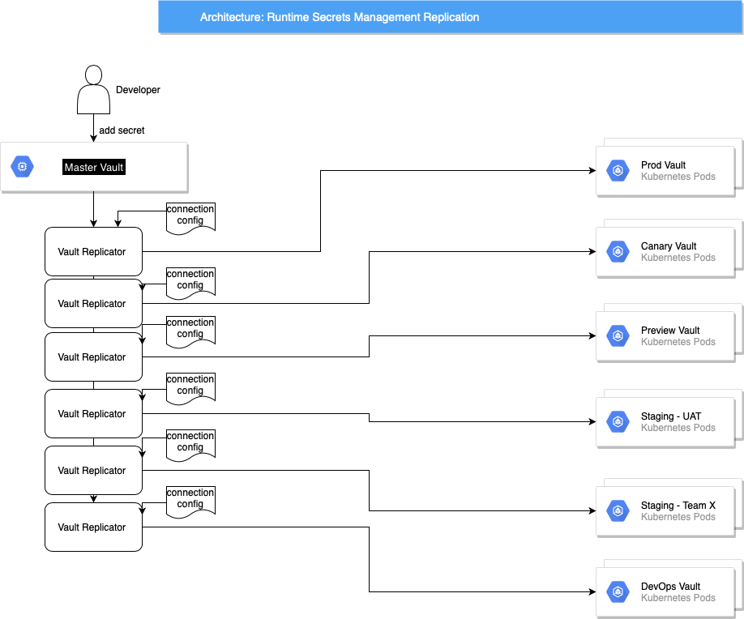

# multi-k8s-cluster-secrets-management
<h2><ins>Description</ins></h2>

The main use case for this is to define different secret branches per environment in your Master Vault instance 
and have them replicated to the Slave Vault instances in those environments. 

This will allow Devs to define their own secrets as needed, and not rely on DevOps to implement them in the different K8s environments.

<h2><ins>Architecture</ins></h2>
 
   
As you can see, all secrets are defined , per environment, in the master Vault, and the replicator
uses a config file to determine what secrets are to be replicated to what slave.

<ins>Note</ins>, Slaves do not have K8s Ingresses. Therefore, only Pods in the Cluster can access them. Further increasing security. 
Access to them, outside the Cluster is via *Kubectl port-forward* by default.

<ins>Note</ins>, Slaves are defined to use Hashicorp Vault `Kubernetes Authentication`. See [hashicorp](https://www.vaultproject.io/docs/auth/kubernetes), or [more detail from OpenShift](https://www.openshift.com/blog/vault-integration-using-kubernetes-authentication-method)
 

<ins>Note</ins>, this repo assumes that you have already implemented your "Master Vault". 

<h2><ins>Creating a Slave Vault</ins></h2>
Creating a slave instance is driven by the *define_vault.sh* script. You can run this in the command line, or in your pipeline of choice.

This script takes three parameters:
*   **Environment:**    This is the name given to the kubernetes context, or environment, you want the Vault instance to be deployed to.
*   **Size:**   This can be either *small* or *large*. Small equates to single nodes for both Vault and Consul (the fault tolerant Data Store), and large equates to a 3 node deployment for each. This allows you to decide sizes per environment.
*   **Master Vault Address**    This overrides the VAULT_ADDR env var for where the script is being run, to ensure assurity of connecting to the right vault instance.

**Example:** `./define-vault.sh minikube small 'http://127.0.0.1:8200'`  
creates a slave in the local minikube instance, with a single pod for Vault and Consul, and defines the root token in the master Vault instance at http://127.0.0.1:8200.
This is obviously for a dev environment, with a dev instance of Vault running as the local master. 

<ins>Note</ins>, the access details for the newly created Vault slave are kept in /secret/vault/`environment` where 'environment' is the same ast the vault of the **Environment** input variable  

<h2><ins>Replicator</ins></h2>
Let's assume you want to create a secret for an API token, and you need to use it in Test, UAT, and production:
1. login in to `your base vault instance` and create a secret called `dev/google/api` and call the field `token`, 
and it's value the value of the token you need in preview 
(assuming it is different to the values in the other environments). It should look like:

2. Do the same for the secret and value you want in Test, except this secret will be called `test/google/api`
3. Do the same for the secret and value you want in Production, except this secret will be called `production/google/api`

That's it!

The vault-replicator pipeline runs regularly and copies all secrets under /secret/preview to the preview Vault instance.

This is the same for /secret/test and /secret/production. 

In the above example the secret in is called `/google/api` in all the environments

#### Configuration

Every task in the pipeline will use a configuration like this above. This is looked after by the Platform team.

* If the target value is `false` it is assumed the source.
* all targets (because their vault instances are not exposed outside the K8s cluster) are accessed via \
 a kubectl port-forward. However the `k8s` value of true forces the replicator to use port-forwarding
* The `env` value points the replicator at the target vault instance
* The `kubectx` value is important as it allows the replicator to use the address and credentials to port-forward to the pod in the cluster

#### Running the Replicator
Running the replicator is driven by the *replicate.sh* script. You can run this in the command line, or in your pipeline of choice.

This script takes three parameters:
*   **Environment:**    This is the name given to the kubernetes context, or environment, that is the target vault.

<h2><ins>Accessing the Secrets in the Environments</ins></h2>
Because of the complications introduced by the much more Kubernetes Auth method, and just to decouple the need to know anything about where the secrets reside in the cluster,
there are a TypeScript amd GoLang Slave wrapper libraries supplied in the /src/client directories.

How to use them, and to run local tests, are decribed in the following README's: [Golang](https://github.com/pogo61/multi-k8s-cluster-secrets-management/blob/master/src/client/GoLang/README.md), and [TypeScript](https://github.com/pogo61/multi-k8s-cluster-secrets-management/blob/master/src/client/typescript/README.md)
